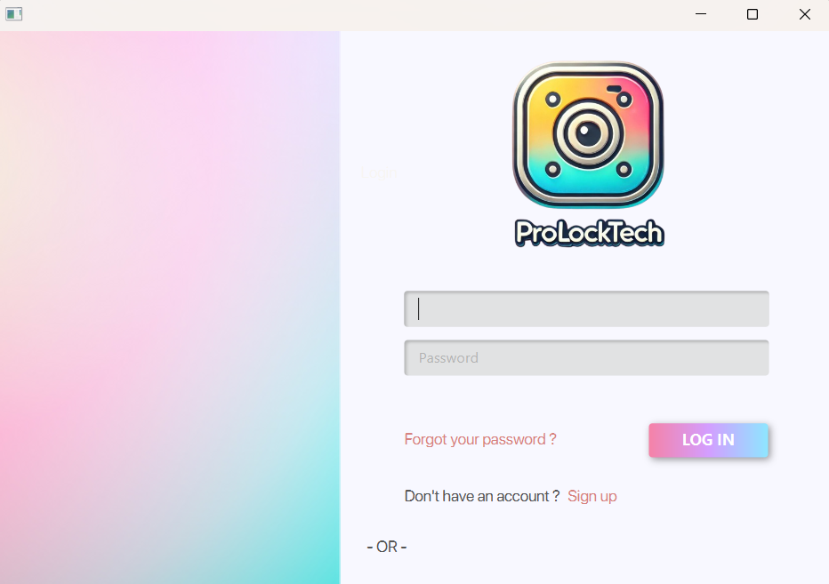
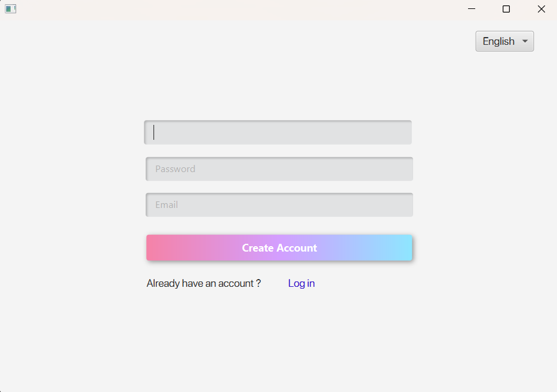
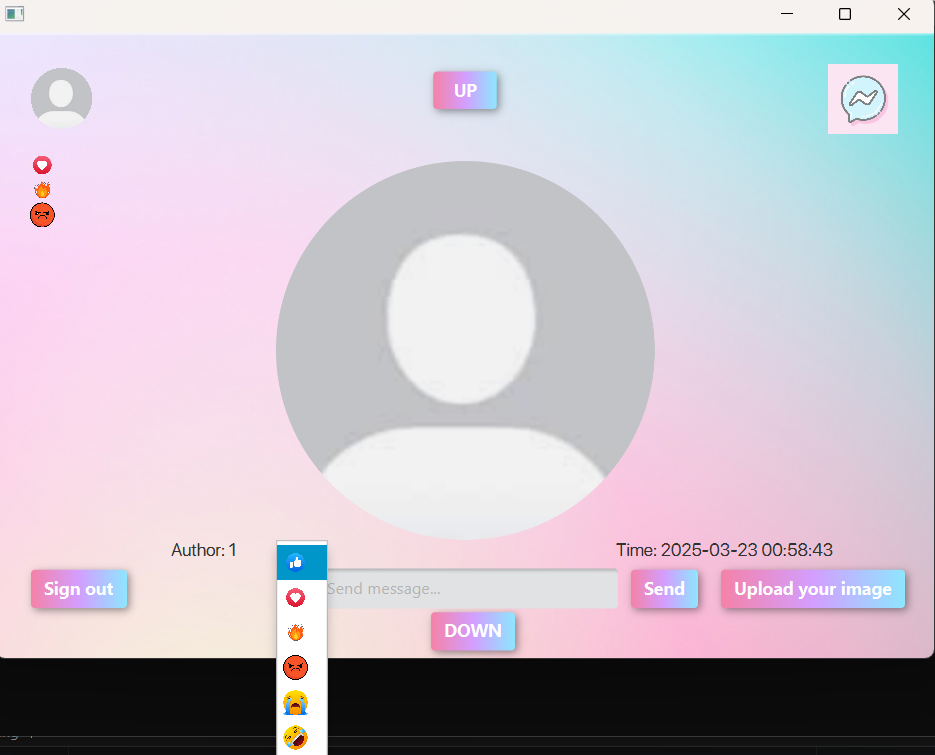
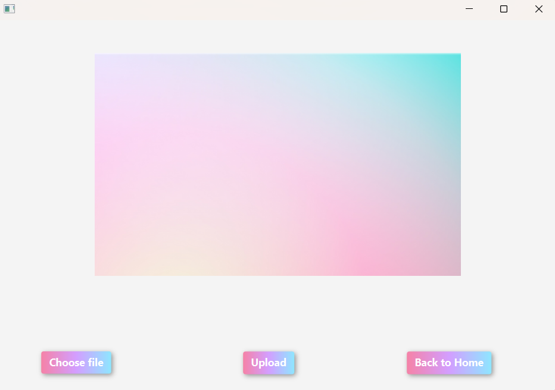
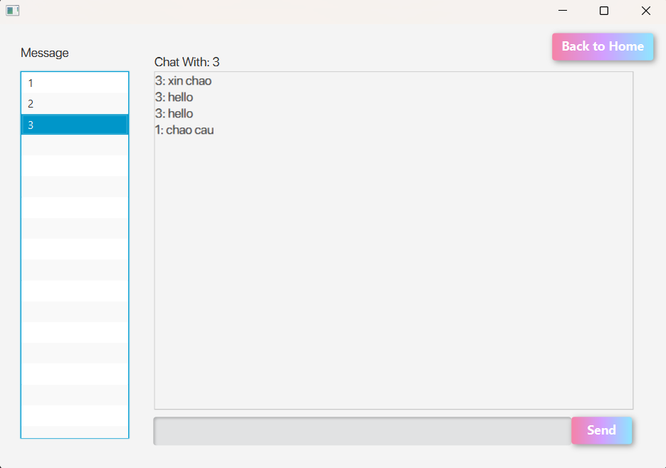
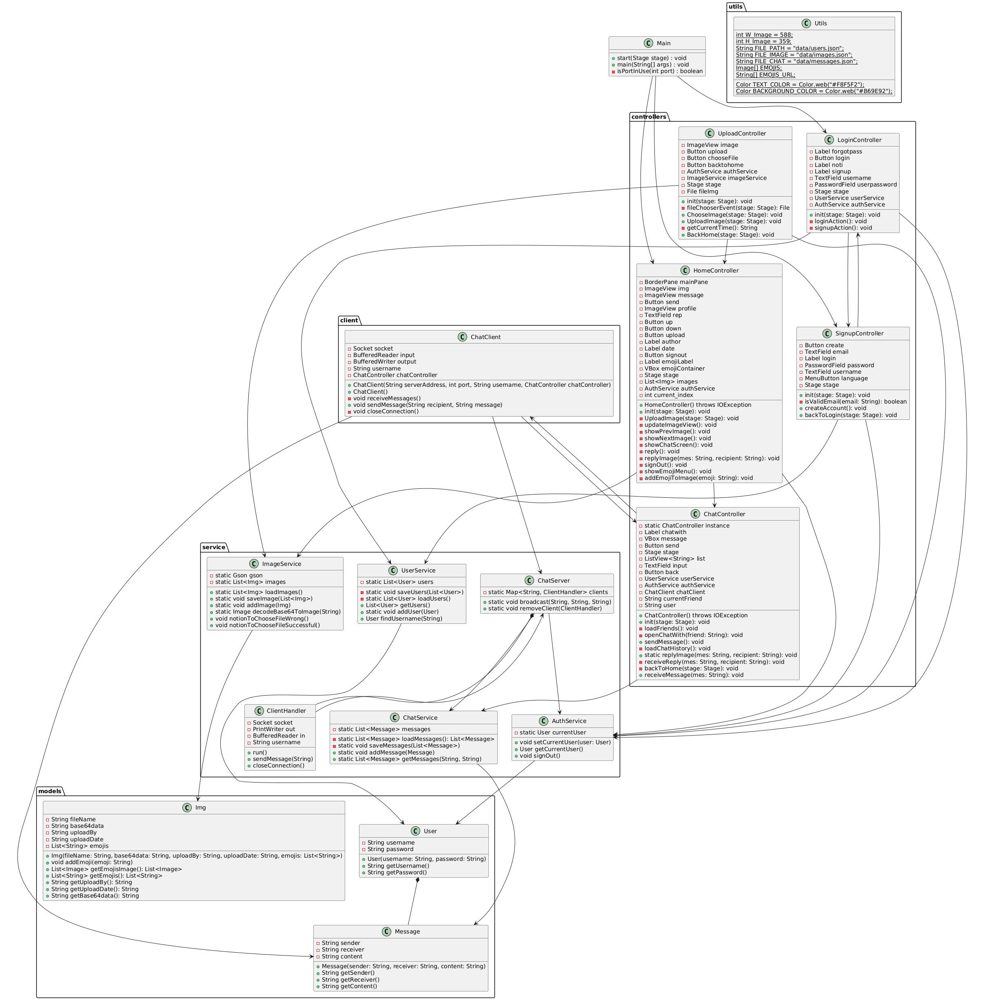
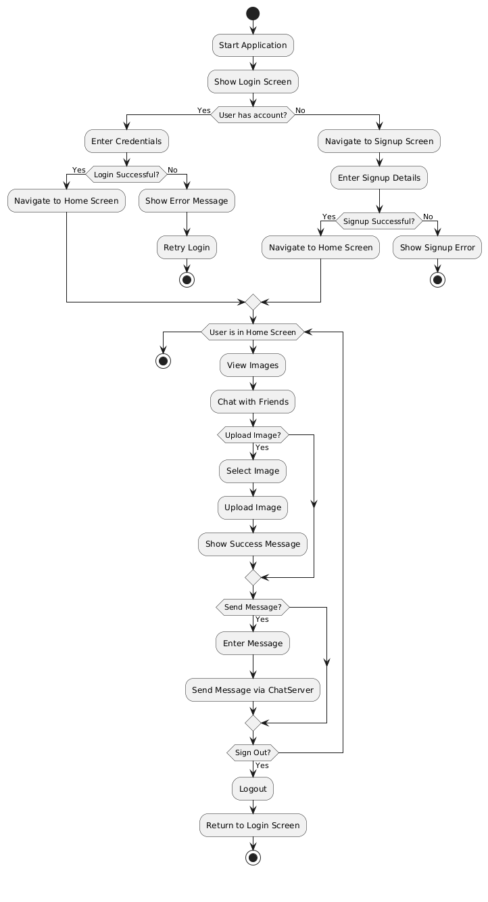

# [Locket máy tính: ProLockTech]

[Mô tả dự án]

Trong bối cảnh người người Locket, nhà nhà Locket hiện nay - thời đại mà trước khi làm bất cứ chuyện gì thì đều cần phải "cúng" Locket.

Để đáp lại cũng như phát triển thêm kiểu dạng như Locket Widget mà mọi người thường dùng trên điện thoại, thì ProLockTech sẽ là sản phẩm cho những người thường sử dụng desktop.

Cũng giống như Locket Widget, ProLockTech là một ứng dụng cung cấp nền tảng chia sẻ hình ảnh và trò chuyện thời gian thực giữa người dùng. Hứa hẹn sẽ mang tới những trải nghiệm thú vị.

## Authors

- [@HieuGM](https://github.com/HieuGM)


## Demo

Link Video Demo:
https://youtu.be/coPBELluq0w


## Screenshots

Demo một số hình ảnh của ứng dụng:











## Features

- Các chức năng chính của ứng dụng:

- Quản Lý Hình Ảnh

    - Người dùng có thể tải lên hình ảnh cá nhân.

    - Hình ảnh hiển thị với thông tin về tác giả và ngày tải lên.

    - Xem danh sách hình ảnh của tất cả người dùng.

    - Cho phép thêm emoji vào ảnh để thể hiện cảm xúc.

- Người dùng có thể trả lời một hình ảnh từ màn hình chính.

    - Khi trả lời, tin nhắn sẽ tự động xuất hiện trong cuộc trò chuyện với người đăng tải ảnh.

- Ứng dụng hỗ trợ trò chuyện trực tuyến, gửi nhận tin nhắn theo thời gian thực
- Có lưu lại lịch sử trò chuyện người dùng

## File Structure
```bash
ProLockTech/
│── src/
│   ├── main/
│   │   ├── java/
│   │   │   ├── prolocktech/
│   │   │   │   ├── client
│   │   │   │   │   ├── ChatClient.java
│   │   │   │   ├── controllers/
│   │   │   │   │   ├── HomeController.java
│   │   │   │   │   ├── ChatController.java
│   │   │   │   │   ├── LoginController.java
│   │   │   │   │   ├── SignupController.java
│   │   │   │   │   ├── UploadController.java
│   │   │   │   ├── models/
│   │   │   │   │   ├── User.java
│   │   │   │   │   ├── Message.java
│   │   │   │   │   ├── Img.java
│   │   │   │   ├── network/
│   │   │   │   ├── services/
│   │   │   │   │   ├── AuthService.java
│   │   │   │   │   ├── UserService.java
│   │   │   │   │   ├── ImageService.java
│   │   │   │   │   ├── ChatService.java
│   │   │   │   │   ├── ChatServer.java
│   │   │   │   │   ├── ClientHandler.java
│   │   │   │   ├── utils/
│   │   │   │   │   ├── Utils.java
│   │   │   │   ├── Main.java
│   │   ├── resources/
│   │   │   ├── styles/
│   │   │   │   ├── styles.css
│   │   │   ├── views
│   │   │   │   ├── chat-screen.fxml
│   │   │   │   ├── home-screen.fxml
│   │   │   │   ├── login-screen.fxml
│   │   │   │   ├── signup-screen.fxml
│   │   │   │   ├── upload-screen.fxml
```

## Requirements

- Java 23
- Maven 4.0.0
- JavaFX 17.0.6
- JDK 24

## Installation

Cách cài đặt dự án

```bash
  - Clone the repository  
  - Open AppLaunch.bat
```

## UML

- Class Diagram:


- Activity Diagram:


## License

[MIT](https://choosealicense.com/licenses/mit/)
